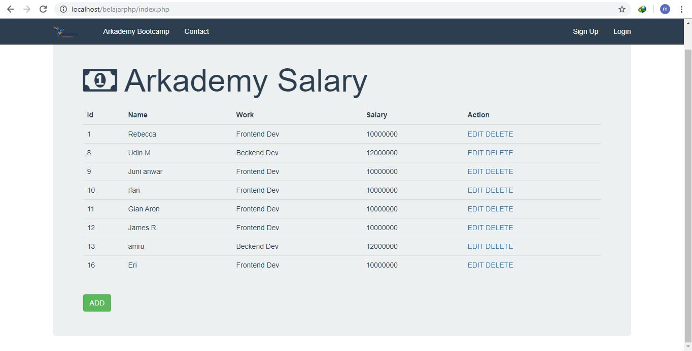
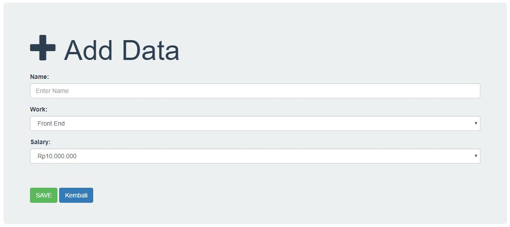
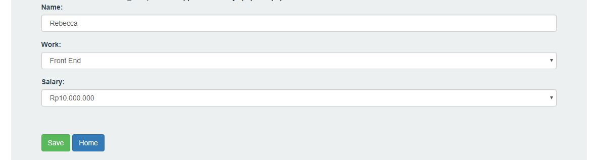

# Arkademy Bootcamp
 
Jawaban Test Muhammad Miftahuddin Ghofur

# Keterangan :
Nomer 1 dan 2 menggunakan bahasa pemrograman PHP. dijalankan menggunakan localhost
  Nomer 3, 4, dan 5 menggunakan bahasa pemrogramman Python 3. dijalankan menggunakan Jupyter Lab

No 6 : 
menggunakan bahasa PHP . dijalankan di localhost

Halaman utama adalah index.php
  Tampilan : 
   

Halaman Tambah Data adalah tambahdata.php
  dengan meng-klik tombol "ADD" maka akan muncul halaman tambah data
  Tampilan : 
   
  Masukan Data dan tambahkan

Halaman Update adalah edit.php
  dengan meng-klik tombol "EDIT" di kolom Action maka akan muncul halaman Edit Data
  Tampilan : 
   
  Ganti data dan simpan

Halaman Hapus adalah hapus.php
  dengan meng-klik tombol "Delete" pada kolom Action maka data yang di pilih akan terhapus
  Tampilan : 
   
  Masukan Data dan tambahkan

